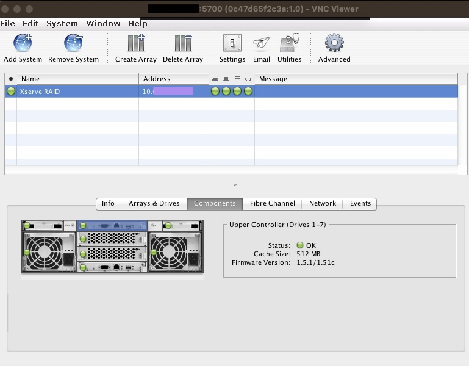

# Xserve RAID Admin Docker

## About
This is a simple Docker container that allows you to use Apple's RAID Admin
tool without having to install ancient versions of Java or use an outdated OS.


________________
## Using Docker Compose
To build and/or run the Docker container, simply run the following command:
```bash
docker-compose up -d
```
To shut down the container, simply run:
```bash
docker-compose down
```

By default, the container will be accessible via VNC on its default port 
(5900). With the password `1234` (very secure, I know). Both of these can
be changed in the `docker-compose.yml` and `Dockerfile` files,
respectively.

________________
## Using RAID Admin
For information on how to use RAID Admin, you can find my blog post on the
subject [here](https://chiefwithcolorfulshoes.com/blog/Using_the_Xserve_RAID/).